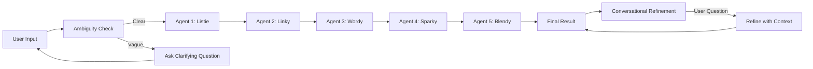

<div align="center">


# Brain Dump 2.0

### You spill it. We distill it. 🧠✨

[](https://react.dev/)
[](https://www.typescriptlang.org/)
[](https://vitejs.dev/)
[](https://ai.google.dev/)
[](./LICENSE)

<p align="center">
  <strong>Transform messy thoughts into actionable insights with AI-powered multi-agent orchestration</strong>
</p>

[Live Demo](https://ai.studio/apps/drive/1hbGKAj_fay5mDn0yYBnxZiKeZTXsT6gI) • [Documentation](./docs/) • [Report Bug](https://github.com/demarcus-crump/Brain-Dump-2.0/issues) • [Request Feature](https://github.com/demarcus-crump/Brain-Dump-2.0/issues)

</div>

---

## 🎭 What is Brain Dump 2.0?

Brain Dump 2.0 is an **interactive portfolio project** that showcases modern web development and AI orchestration through a theatrical, multi-agent system. Got a rambling thought? A chaotic brain dump? Feed it to our **5 quirky AI agents** who collaborate to extract meaning, find connections, challenge assumptions, and deliver crystal-clear insights.

This isn't just another AI chatbot—it's a choreographed performance where each agent has a unique role, personality, and visual identity. Built with React 19, powered by Google's Gemini AI, and animated with Framer Motion, it demonstrates:

- 🤖 **Multi-Agent AI Orchestration** - Five specialized agents working in sequence
- 🎪 **Theatrical UI/UX** - Kinetic typography, custom cursors, parallax scrolling
- 🤝 **Human-in-the-Loop (HITL)** - Smart ambiguity detection for better results
- 💬 **Conversational Refinement** - Continue the dialogue after results
- ✨ **Playful Interactions** - Magnetic buttons, confetti celebrations, smooth animations

> **Note:** This is a demonstration/portfolio project designed to showcase technical skills in React, TypeScript, AI integration, and creative UI design. It uses the Google Gemini 2.5 Flash API for all AI processing.

---

## 🌟 Key Features

### 🎨 The 5-Agent Pipeline

Meet the team that turns your brain dump into brilliance:

| Agent | Role | Color | What They Do |
|-------|------|-------|--------------|
| 🎧 **Listie** | The Listener |  `#FF3366` | Extracts key points and action items from raw input |
| 🔗 **Linky** | The Connector |  `#00E5B8` | Finds relationships, patterns, and contradictions |
| 📖 **Wordy** | The Translator |  `#FFD426` | Clarifies language and simplifies complex concepts |
| 💥 **Sparky** | The Challenger |  `#FF6B2C` | Identifies assumptions, gaps, and questions |
| 🎯 **Blendy** | The Synthesizer |  `#7B5CFF` | Weaves everything into a final, coherent interpretation |

Each agent has their own catchphrase and personality—learn more in [docs/AGENTS.md](./docs/AGENTS.md)!

### 🤝 Human-in-the-Loop Intelligence

Before processing, **Listie** checks if your input is too vague. If it is, you'll get a friendly clarifying question to help refine your thought. This ensures higher quality results and showcases practical HITL implementation.

### 🎪 Theatrical Processing Experience

- **Custom Cursor** - Interactive hover effects throughout the app
- **Kinetic Logo** - Bouncing, pulsing animations with parallax scrolling
- **Processing Theater** - Watch agents "think" with animated backgrounds and typewriter text
- **Magnetic Buttons** - Buttons that respond to your cursor with smooth transitions
- **Confetti Celebrations** - Because good insights deserve celebration! 🎉

### 💬 Post-Result Conversation

After the agents finish, you can continue the conversation. Ask follow-up questions or request refinements, and the system will iterate on the results using the chat history.

---

## 🚀 Quick Start

### Prerequisites

- **Node.js** (v18 or higher)
- **Google Gemini API Key** - [Get one here](https://ai.google.dev/)

### Installation

1. **Clone the repository**
   ```bash
   git clone https://github.com/demarcus-crump/Brain-Dump-2.0.git
   cd Brain-Dump-2.0
   ```

2. **Install dependencies**
   ```bash
   npm install
   ```

3. **Set up environment variables**
   
   Create a `.env.local` file in the root directory:
   ```bash
   cp .env.example .env.local
   ```
   
   Add your Gemini API key:
   ```env
   GEMINI_API_KEY=your_gemini_api_key_here
   ```

4. **Run the development server**
   ```bash
   npm run dev
   ```

5. **Open your browser**
   
   Navigate to `http://localhost:5173` (or the port shown in your terminal)

### Build for Production

```bash
npm run build
npm run preview
```

---

## 🛠️ Tech Stack

| Category | Technologies |
|----------|-------------|
| **Frontend Framework** | React 19 with TypeScript |
| **Build Tool** | Vite 6.2 |
| **Styling** | Tailwind CSS (via inline styles/classes) |
| **Animations** | Framer Motion 12 |
| **Icons** | Lucide React |
| **AI/ML** | Google Gemini 2.5 Flash API (`@google/genai`) |
| **Type Safety** | TypeScript 5.8 |

---

## 📁 Project Structure

```
Brain-Dump-2.0/
├── components/              # React components
│   ├── AgentDisplay.tsx    # Agent avatar and info display
│   ├── AmbiguityModal.tsx  # HITL clarification modal
│   ├── Confetti.tsx        # Celebration animations
│   ├── CustomCursor.tsx    # Custom cursor component
│   ├── InputSection.tsx    # User input interface
│   ├── KineticLogo.tsx     # Animated logo with parallax
│   ├── MagneticButton.tsx  # Interactive button component
│   ├── ProcessingBackground.tsx  # Animated processing backdrop
│   ├── ProcessingTheater.tsx     # Agent processing showcase
│   ├── ResultReveal.tsx    # Results display with conversation
│   └── TypewriterText.tsx  # Typewriter animation effect
├── services/
│   └── geminiService.ts    # Gemini API integration & agent logic
├── docs/                    # Documentation
│   ├── AGENTS.md           # Detailed agent documentation
│   ├── ARCHITECTURE.md     # Technical architecture
│   └── DESIGN_SYSTEM.md    # Design tokens and guidelines
├── App.tsx                 # Main application component
├── constants.ts            # Agent configurations and constants
├── types.ts                # TypeScript type definitions
├── index.tsx               # Application entry point
├── .env.example            # Environment variable template
├── CONTRIBUTING.md         # Contribution guidelines
├── CODE_OF_CONDUCT.md      # Code of conduct
└── LICENSE                 # MIT License
```

---

## 🎨 How It Works

### The 5-Agent Pipeline in Action



1. **Input Stage** - User enters their brain dump (anything from meeting notes to rambling thoughts)

2. **Ambiguity Check** - Listie evaluates if the input is too vague and asks for clarification if needed

3. **Sequential Processing** - Each agent processes in order:
   - Listie extracts raw facts and key points
   - Linky identifies relationships and contradictions
   - Wordy clarifies and simplifies the language
   - Sparky challenges assumptions and finds gaps
   - Blendy synthesizes everything into a final interpretation

4. **Result Display** - Animated reveal with confetti and the final interpretation

5. **Refinement** - Continue the conversation with follow-up questions

For a deep dive into the architecture, see [docs/ARCHITECTURE.md](./docs/ARCHITECTURE.md).

---

## 🎯 Use Cases

- **Meeting Notes Distillation** - Turn rambling meeting notes into clear action items
- **Idea Brainstorming** - Dump scattered thoughts and get structured insights
- **Content Planning** - Organize messy content ideas into coherent themes
- **Problem Analysis** - Get multiple perspectives on a complex problem
- **Learning Aid** - Simplify complex topics you're trying to understand

---

## 🤝 Contributing

Contributions, issues, and feature requests are welcome! See [CONTRIBUTING.md](./CONTRIBUTING.md) for guidelines.

### Development Setup

1. Fork the repository
2. Create your feature branch: `git checkout -b feature/amazing-feature`
3. Commit your changes: `git commit -m 'Add amazing feature'`
4. Push to the branch: `git push origin feature/amazing-feature`
5. Open a Pull Request

---

## 📄 License

This project is licensed under the **MIT License** - see the [LICENSE](./LICENSE) file for details.

---

## 🙏 Credits & Acknowledgments

**Created by:** [Demarcus Crump](https://github.com/demarcus-crump)

**Powered by:**
- [Google Gemini AI](https://ai.google.dev/) - AI processing backbone
- [React](https://react.dev/) - UI framework
- [Framer Motion](https://www.framer.com/motion/) - Animation library
- [Vite](https://vitejs.dev/) - Build tool
- [Lucide](https://lucide.dev/) - Icon library

**Inspired by:** The need to make sense of chaotic thoughts and the desire to create delightful, theatrical user experiences.

---

## 🌐 Links

- **Live Demo:** https://ai.studio/apps/drive/1hbGKAj_fay5mDn0yYBnxZiKeZTXsT6gI
- **Repository:** https://github.com/demarcus-crump/Brain-Dump-2.0
- **Issues:** https://github.com/demarcus-crump/Brain-Dump-2.0/issues

---

<div align="center">

Made with ❤️ and ☕ by Demarcus Crump

**Remember:** You spill it. We distill it. 🧠✨

</div>
