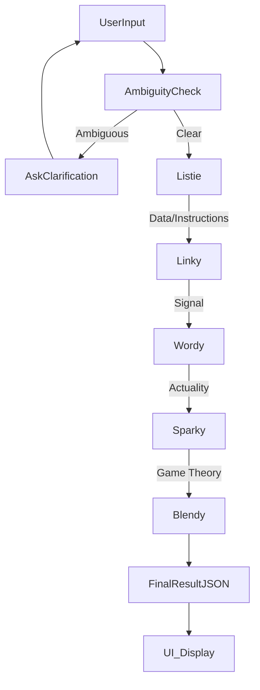

# Architecture Overview

## System Overview

Brain Dump 2.0 is a client-side React application that orchestrates a multi-step AI pipeline using the Google Gemini API. It follows a **Sequential Processing Model** where the output of one agent becomes the context for the next, culminating in a synthesized result.

## Core Components

### 1. The Service Layer (`services/geminiService.ts`)
This is the brain of the application. It manages the API calls to Google GenAI.

- **Ambiguity Check**: Uses `gemini-2.5-flash` with a JSON schema to determine if input is valid.
- **Pipeline Execution**:
    1. `runListieAgent` (Flash): Decodes Data vs. Instructions.
    2. `runLinkyAgent` (Flash): Detects Signal vs. Noise.
    3. `runWordyAgent` (Flash): Collapses Possibility to Actuality.
    4. `runSparkyAgent` (Flash): Game Theory analysis (Reveal vs. Conceal).
    5. `runBlendyAgent` (Pro): Synthesizes all previous outputs into a final JSON result.
- **Refinement**: `refineResult` allows for conversational updates to the generated plan.

### 2. The State Machine (`App.tsx`)
The application flow is controlled by the `AppState` enum:
- `IDLE`: Waiting for input.
- `AMBIGUITY_CHECK`: Verifying input quality.
- `PROCESSING`: Running the 5-agent pipeline (visualized by `ProcessingTheater`).
- `RESULT`: Showing the `ResultReveal`.
- `ERROR`: Error handling state.

### 3. The Visual Layer (Components)
- **`AgentDisplay.tsx`**: A highly animated SVG component that changes state (`idle`, `working`, `complete`) and personality based on the `AgentId`. Uses Framer Motion for performant SVG path morphing.
- **`ProcessingTheater.tsx`**: An immersive overlay that manages the "Relay Race" visualization of the agents.
- **`ResultReveal.tsx`**: Displays the final JSON data in a gamified report card format.

## Data Flow

## Technology Choices

- **React 19**: For robust component management and state handling.
- **Framer Motion**: Chosen over CSS animations for complex SVG morphing and physics-based interactions (springs).
- **Tailwind CSS**: For rapid styling and consistent design system tokens (colors/spacing).
- **Google GenAI SDK**: Direct integration with Gemini models.

## Scalability & Limitations

- **Current Limitation**: The app is client-side only. API keys must be handled carefully in production (e.g., via a proxy server).
- **Context Window**: The pipeline passes text strings sequentially. Extremely long inputs might hit token limits on `gemini-2.5-flash`, though unlikely for typical "brain dumps".
